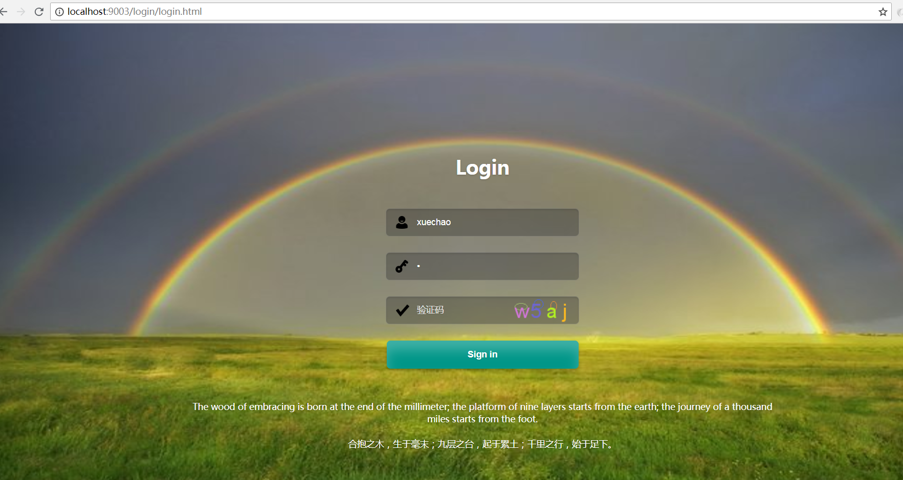
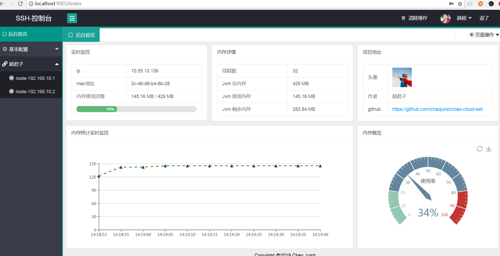
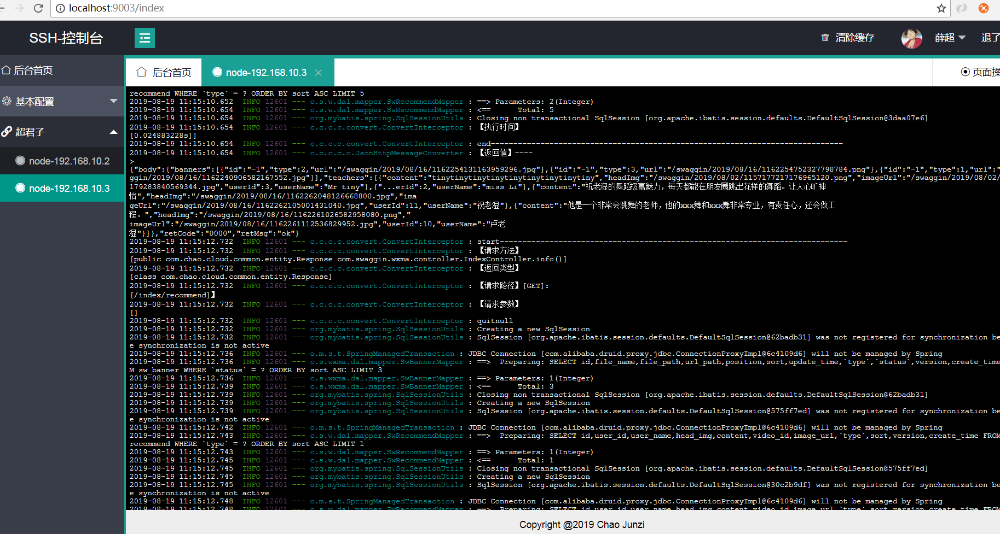
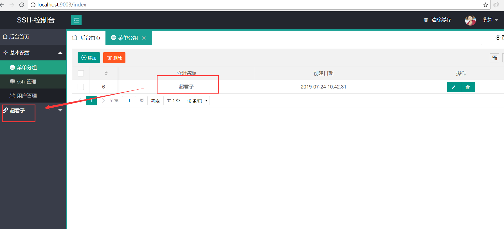
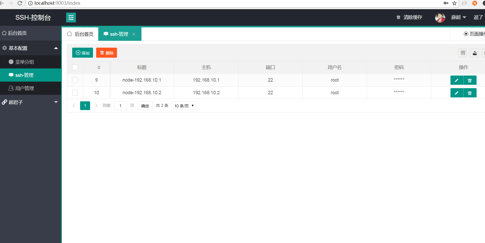
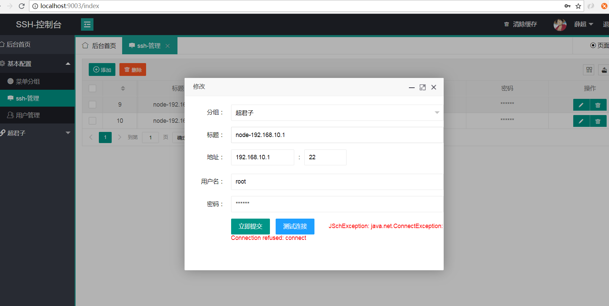

  

  

## chao-cloud-ssh

spring-boot为基础，websocket+mybatis-plus+layui+jsch+(线程池+io流)

## 开发计划
- 网页连接ssh（已完成）
- 文件列表（未完成）
- 文件上传（未完成）
- 文件下载（未完成）
- 文件删除（未完成）

## 效果图展示

 
 
 
 
 
 

## 版权

### Apache License Version 2.0  

- 如不特殊注明，所有模块都以此协议授权使用。
- 任何使用了chao-cloud-ssh的全部或部分功能的项目、产品或文章等形式的成果必须显式注明chao-cloud-ssh。

### NPL (The 996 Prohibited License)

- 不允许 996 工作制度企业使用该开源软件

### 鸣谢
- [JSCH@官网](http://www.jcraft.com/jsch)  
- [hutool-超级工具类](https://github.com/looly/hutool)  
- [lombok](https://github.com/rzwitserloot/lombok)  
- [mybatis-plus](https://github.com/baomidou/mybatis-plus)  
- [layui](https://github.com/sentsin/layui/)  
- [......](https://github.com/)  

感谢诸位用户的关注和使用，chao-cloud-ssh并不完善，未来还恳求各位开源爱好者多多关照，提出宝贵意见。

作者 [@chaojunzi 1521515935@qq.com]

2019年8月19日